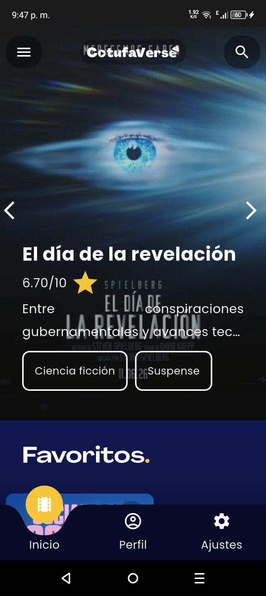
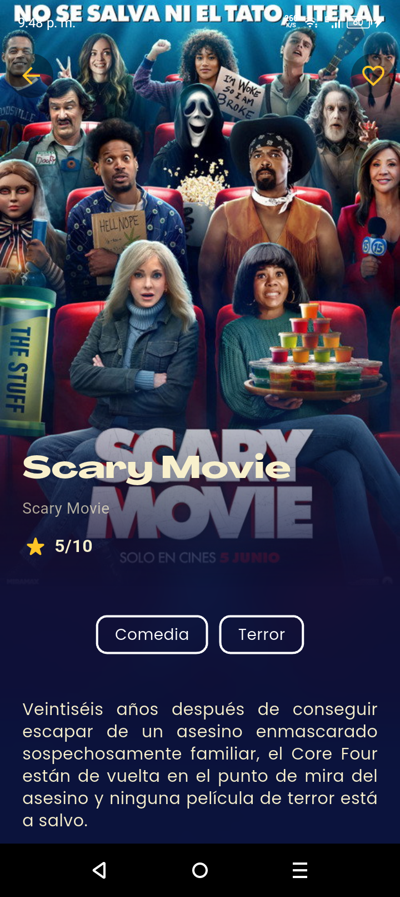
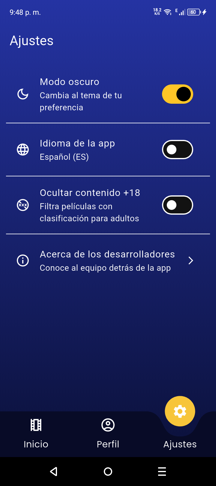

# 🍿 CotufaVerse

Una aplicación móvil desarrollada en **Flutter** para explorar, buscar y guardar tus películas favoritas utilizando la base de datos de TMDB (The Movie Database).

## 👥 Autores

Somos estudiantes de Ingeniería de Sistemas en la Universidad de Margarita y este es nuestro proyecto final de la materia de Programación III.
- [@Acthel12](https://github.com/Acthel12)
- [@juanfranciscovm](https://github.com/juanfranciscovm)

## ✨ ¿Qué puedes hacer en la app?

* **Explorar:** descubre películas en cartelera, populares, mejor valoradas y próximos estrenos.
* **Tu cuenta TMDB:** inicia sesión de forma segura con tu cuenta real de The Movie Database. (solo funciona en un dispositivo Android)
* **Favoritos:** guarda las películas que más te gusten en tu colección personal.
* **Búsqueda avanzada:** encuentra películas por título o fíltralas por género.
* **Personalización:** cambia entre modo claro/oscuro y ajusta el idioma (soportado español e inglés hasta el momento).

## 📱 Demostración

| Home | Details | Config |
| :---: | :---: | :---: |
|  |  |  |

## 📲 Descargar la app (APK)

👉 **[Descargar CotufaVerse APK](https://github.com/juanfranciscovm/cotufaverse/releases/download/Release/app-release.apk)**

*(Nota: para instalarla, es posible que tu teléfono te pida permisos para "instalar aplicaciones de orígenes desconocidos").*

## 🛠️ Para desarrolladores (código fuente)

Si quieres ver cómo está hecha o correr el proyecto en tu máquina local:

1. Clona este repositorio:
   `git clone https://github.com/juanfranciscovm/cotufaverse.git`

2. Instala las dependencias:
   `flutter pub get`

3. Agrega tu API Key: 
   Ve a `lib/provider/movies_provider.dart` y coloca tu clave de TMDB en la variable `_apiKey`.

4. Ejecuta la app:
   `flutter run`

---
*Desarrollado con ❤️ usando Flutter.*
